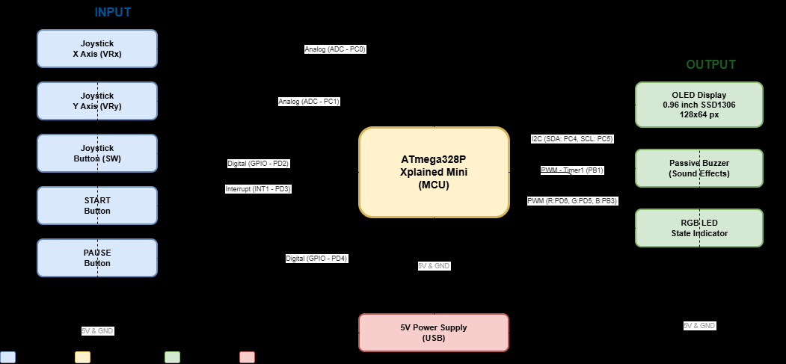
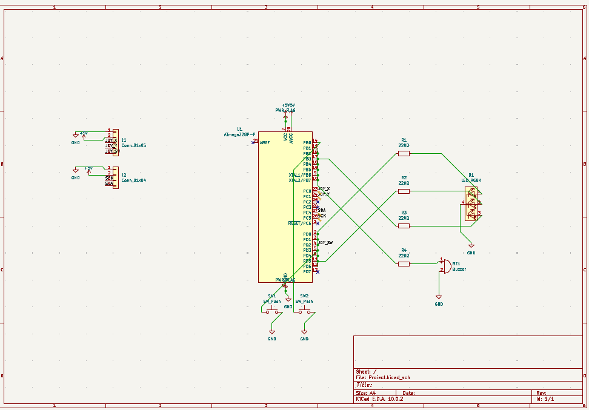

# MiniGameConsole

A portable retro game console built from scratch on the **ATmega328P** microcontroller (ATmega328P Xplained Mini board). It runs two fully playable games — **Breakout** and **Flappy Bird** — on a 128×64 OLED screen, with joystick control, sound effects, RGB LED feedback, and persistent high-score leaderboards stored in EEPROM.

The entire project is written in **bare-metal C (AVR-GCC)**, with no Arduino library dependencies. Every peripheral — I2C, ADC, PWM, USART, timers — is configured by writing directly to the ATmega328P hardware registers.

---

## Table of Contents

- [General Description](#general-description)
- [Video Demo](#video-demo)
- [Hardware Components](#hardware-components)
- [Block Diagram](#block-diagram)
- [Electrical Schematic](#electrical-schematic)
- [Software Architecture](#software-architecture)
  - [Application State Machine](#application-state-machine)
  - [Rendering Pipeline (SSD1306 OLED Driver)](#rendering-pipeline-ssd1306-oled-driver)
  - [Input Handling (ADC + Buttons)](#input-handling-adc--buttons)
  - [Audio System (Buzzer via Timer 1)](#audio-system-buzzer-via-timer-1)
  - [RGB LED Feedback (PWM via Timer 0 & Timer 2)](#rgb-led-feedback-pwm-via-timer-0--timer-2)
  - [EEPROM High-Score System](#eeprom-high-score-system)
  - [Game Logic: Flappy Bird](#game-logic-flappy-bird)
  - [Game Logic: Breakout](#game-logic-breakout)
- [Repository Structure](#repository-structure)
- [Building & Uploading](#building--uploading)
- [Project Photos](#project-photos)
- [Resources](#resources)

---

## General Description

The MiniGameConsole is a self-contained handheld gaming device. The user interacts with the console through a dual-axis analog joystick (for navigation and gameplay), a joystick click button (for selection and in-game actions), and two external tactile buttons:

- **BACK** (PD3) — navigates one level back in the menu hierarchy, and pauses/unpauses gameplay.
- **HOME** (PB0) — instantly returns to the game selection screen from anywhere in the application.

The console boot sequence initializes all peripherals (I2C, ADC, PWM, USART) and enters the main menu, where the user selects a game. Each game supports two modes:

- **Ranked** — the player enters a name (up to 8 characters via an on-screen keyboard), and the final score is saved to the EEPROM leaderboard at the end of the round.
- **For Fun** — gameplay without score tracking.

Breakout also features a pre-game settings screen where the player can adjust ball speed, paddle speed, and starting lives using slider controls.

---

## Video Demo

Project Demo: **[Watch Video Demo](https://drive.google.com/file/d/1Ku0gMX8YAwAy4_f3ThMjZ6lDsRshhfK5/view?usp=sharing)**.

---

## Hardware Components

| # | Component | Role | Interface |
|---|-----------|------|-----------|
| 1 | **ATmega328P Xplained Mini** | Main MCU, 16 MHz, 2 KB SRAM, 32 KB Flash, 1 KB EEPROM | — |
| 2 | **SSD1306 OLED Display** (128×64) | Game graphics, menus, leaderboards | I2C (400 kHz Fast Mode) via PC4/PC5 |
| 3 | **KY-023 Dual-Axis Joystick** | Analog X/Y navigation + digital click button | ADC0 (PC0), ADC1 (PC1), digital PD2 |
| 4 | **RGB LED** (common cathode) | Visual state feedback (lives, score zones, events) | PWM on PD6, PD5, PB3 via Timer 0 & Timer 2 |
| 5 | **Passive Buzzer** | Sound effects and melodies | CTC on PB1 via Timer 1 |
| 6 | **BACK Button** | Menu navigation / Pause toggle | Digital input PD3 (internal pull-up) |
| 7 | **HOME Button** | Reset to home screen | Digital input PB0 (internal pull-up) |
| 8 | **3× 220Ω Resistors** | Current limiting for RGB LED channels | Series with LED anodes |

Complete pin mapping and wiring details: **[Hardware README](hardware/README.md)**

---

## Block Diagram



## Electrical Schematic



---

## Software Architecture

### Application State Machine

The application is driven by a single `while(1)` loop in `main.c` that implements a finite state machine with 8 states:

| State | Name | Description |
|-------|------|-------------|
| `ST_CON` | Console Select | Top-level screen — choose between Breakout and Flappy Bird |
| `ST_GM` | Game Menu | Per-game menu — Play Game or view Leaderboard |
| `ST_MD` | Mode Select | Choose Ranked (with name entry) or For Fun |
| `ST_NM` | Name Entry | On-screen 4×7 character grid keyboard for entering the player name |
| `ST_LB` | Leaderboard | Scrollable top-25 high scores loaded from EEPROM |
| `ST_BS` | Breakout Settings | Adjust ball speed, paddle speed, and lives via analog sliders |
| `ST_BK` | Breakout Gameplay | Active Breakout game loop (update → render each tick) |
| `ST_FP` | Flappy Gameplay | Active Flappy Bird game loop (update → render each tick) |

Each iteration of the main loop reads all inputs once (joystick X/Y via ADC, joystick click, BACK and HOME buttons), computes edge-detection flags (`bp`, `bkp`, `home_p`) to distinguish a fresh press from a held button, and then dispatches to the current state handler via a `switch` block.

The main loop runs at approximately **30 FPS** (`_delay_ms(33)` at the end of each iteration), except in the Breakout Settings screen which uses 50 ms delays for smoother slider control.

---

### Rendering Pipeline (SSD1306 OLED Driver)

The display driver in `ssd1306.c` implements a **double-buffered** rendering model:

1. **Clear** — `ssd1306_clear()` zeroes the 1024-byte RAM framebuffer using `memset`.
2. **Draw** — Game logic calls drawing primitives (`draw_pixel`, `draw_hline`, `draw_vline`, `fill_rect`, `draw_char`, `draw_string`, `draw_number`) which modify only the RAM buffer.
3. **Flush** — `ssd1306_update()` transmits the entire 1024-byte buffer to the OLED over I2C, page by page (8 pages × 128 columns).

**Key implementation choices:**

- **I2C at 400 kHz (Fast Mode):** The TWI hardware is configured with `TWBR = 12` and prescaler = 1, yielding exactly `16 MHz / (16 + 2×12×1) = 400 kHz`. This is the maximum speed supported by most SSD1306 modules, minimizing the time spent transmitting the framebuffer.
- **Optimized `fill_rect`:** The original pixel-by-pixel implementation called `draw_pixel` for every point in a rectangle (e.g., 8×40 = 320 calls for a single Flappy Bird pipe). This was replaced with a **page-aligned bitmask approach** that computes a bitmask per page (8 vertical pixels) and applies it to each column in a single byte operation. This reduced per-frame operations from ~3000 to ~200–300 for a typical Flappy Bird frame, completely eliminating visual stutter at higher difficulty levels.
- **Custom 5×7 font stored in PROGMEM:** Characters are read from Flash via `pgm_read_byte()`, keeping the font data out of the limited 2 KB SRAM.
- **I2C timeout protection:** A busy-wait loop with a 5000-iteration (~2 ms) timeout prevents the system from locking up if the display is disconnected or the I2C bus hangs.

---

### Input Handling (ADC + Buttons)

The joystick's two analog axes are read via the ATmega328P's built-in 10-bit ADC:

- **Reference voltage:** AVCC (5V), set via `ADMUX = (1 << REFS0)`.
- **Clock prescaler:** 128 → ADC clock = 125 kHz (within the recommended 50–200 kHz range for maximum accuracy).
- **Noise filtering:** Each `adc_read()` performs a dummy read (to discharge the internal sample capacitor from the previous channel), followed by **4 consecutive readings averaged together**. This produces stable values even with noisy breadboard connections.
- **Deadzone handling:** The joystick center rests at ~512. The code defines thresholds (e.g., `< 300` = up, `> 724` = down) with a wide deadzone in the middle to prevent unintentional drift.

Buttons use the ATmega328P's **internal pull-up resistors** (enabled by setting the PORT bit while the DDR bit is cleared). A pressed button reads as logic LOW. Edge detection is implemented by comparing each button's current state against the previous frame's state (`bp = btn && !prev_btn`).

---

### Audio System (Buzzer via Timer 1)

The passive buzzer is driven by **Timer 1 in CTC mode** with **OC1A toggle on compare match**, generating a 50% duty-cycle square wave at a programmable frequency:

- **Formula:** `OCR1A = F_CPU / (2 × prescaler × freq) - 1 = 125000 / freq - 1` (with prescaler = 64).
- **Silent state:** When stopped, the pin PB1 is set as **high-impedance input** (`DDRB &= ~(1 << PB1)`) to completely disconnect the buzzer and prevent residual clicks or hum. This was chosen over simply driving the pin LOW because the toggle mode can leave the pin in an unpredictable state.
- **Non-blocking tone generation:** Once configured, Timer 1 continuously toggles PB1 at the desired frequency without CPU intervention. The main loop remains free to process inputs and render frames. Short `_delay_ms()` calls are used only for brief sound effects (15–150 ms), which are acceptable within a 33 ms frame budget.

Sound effects include:
- **Flappy Bird:** 2 kHz chirp on flap, 3 kHz ping on scoring, descending 600→400→200 Hz melody on game over.
- **Breakout:** 4 kHz click on brick destruction, 300/200 Hz double-pulse on life lost, ascending C-E-G-C victory fanfare on clearing all bricks.

---

### RGB LED Feedback (PWM via Timer 0 & Timer 2)

The RGB LED channels are driven by hardware PWM on three pins:

| Channel | Pin | Timer | Register |
|---------|-----|-------|----------|
| Red | PD6 | Timer 0 (OC0A) | `OCR0A` |
| Green | PD5 | Timer 0 (OC0B) | `OCR0B` |
| Blue | PB3 | Timer 2 (OC2A) | `OCR2A` |

Both timers are configured in **Fast PWM mode** (Mode 3) with **non-inverting output** and a prescaler of 64, resulting in a PWM frequency of `16 MHz / (64 × 256) ≈ 976 Hz` — well above the flicker perception threshold.

Setting a color is as simple as writing to three OCR registers:
```c
void set_rgb_color(uint8_t red, uint8_t green, uint8_t blue) {
    OCR0A = red;    // PD6
    OCR0B = green;  // PD5
    OCR2A = blue;   // PB3
}
```

The LED color encodes game state:
- 🟢 **Green** — game start / low score / full lives
- 🟠 **Orange** — medium score / reduced lives
- 🔴 **Red** — high score / last life / game over
- ⚪ **White flash** — point scored (brief 15–20 ms pulse)

---

### EEPROM High-Score System

The ATmega328P has 1 KB of EEPROM. The leaderboard system divides it into **two 276-byte blocks** (one per game):

```
Block layout (276 bytes per game):
  Byte 0:         entry count (0–25)
  Bytes 1–275:    25 entries × 11 bytes each
                    └── 9 bytes name (8 chars + null) + 2 bytes score (uint16_t)
```

- **Game 0 (Breakout):** EEPROM addresses 0–275
- **Game 1 (Flappy Bird):** EEPROM addresses 276–551

**Implementation choices:**
- **Sorted insertion:** New scores are inserted in descending order. If a player name already exists, the old entry is removed before re-inserting the new score (only if it's higher).
- **`eeprom_update_byte` / `eeprom_update_word`:** These AVR-libc functions only write to EEPROM if the value actually changed, extending the EEPROM's lifespan (rated for ~100,000 write cycles per cell).
- **Uninitialized EEPROM detection:** A fresh EEPROM reads as `0xFF` in every byte. The `scores_load` function treats a count value > `MAX_SCORES` (25) as uninitialized and returns 0 entries.

---

### Game Logic: Flappy Bird

The bird's vertical position uses **fixed-point arithmetic** (multiplied by 16) for sub-pixel precision despite using only integer math:
- `bird_y` is stored as `int16_t` in units of 1/16th pixel.
- **Gravity:** +5 units per frame → ~0.31 px/frame downward acceleration.
- **Flap impulse:** −37 units → ~2.3 px/frame instant upward velocity.
- **Terminal velocity cap:** 40 units → ~2.5 px/frame.

**Adaptive difficulty:** As the score increases:
- **Scroll speed** ramps from 2 px/frame (score 0–14) → 3 px/frame (15–29) → 4 px/frame (30+).
- **Pipe gap** shrinks from 20 px → down to 14 px (−1 px every 5 points, capped at −6).

Three pipes cycle on-screen. When a pipe scrolls off the left edge, it is repositioned 45 px behind the rightmost visible pipe with a new random gap position. The PRNG is a **16-bit Linear Feedback Shift Register (LFSR)** seeded from analog noise (`adc_read(2) ^ (adc_read(3) << 4) ^ 0xACE1`).

Collision detection checks whether the bird's bounding box (4×4 px) overlaps a pipe column. A 2 px tolerance is applied at the pipe entrance to make gameplay feel fair. If the bird is already inside the pipe gap (tunnel), it slides along the ceiling/floor instead of dying.

---

### Game Logic: Breakout

Ball and paddle positions also use **fixed-point (×16)** arithmetic for smooth diagonal movement.

**Paddle control** is proportional to joystick deflection — the further the joystick is pushed from center, the faster the paddle moves. The mapping is:
```
speed = (deflection × paddle_speed) / 2000 + 1
```

**Brick storage** is extremely memory-efficient: 4 rows of 8 bricks are stored as **4 bytes** (one bit per brick), using `bricks[row] & (1 << col)` to test and `bricks[row] &= ~(1 << col)` to destroy.

**Paddle collision** uses previous-frame position to determine whether the ball hit the paddle from the top or from the side:
- **Top hit:** The ball's horizontal velocity is adjusted based on where it struck the paddle surface (far left = −48, left = −32, center = 16, right = 32, far right = 48), allowing the player to aim.
- **Side hit:** The ball's horizontal direction is simply reversed.

The settings screen provides real-time tuning of ball speed, paddle responsiveness, and starting lives (1–3) using visual sliders drawn with `fill_rect`.

---

## Repository Structure

```
├── src/                    # Source code (all .c and .h files)
│   ├── main.c              # State machine, menu system, and game loop
│   ├── flappy.c / .h       # Flappy Bird game logic and rendering
│   ├── breakout.c / .h     # Breakout game logic and rendering
│   ├── ssd1306.c / .h      # OLED display driver (I2C, framebuffer, primitives)
│   ├── i2c.c / .h          # Hardware I2C (TWI) driver at 400 kHz
│   ├── adc.c / .h          # ADC driver with noise-filtered reads
│   ├── buzzer.c / .h       # Timer 1 CTC tone generation
│   ├── pwm.c / .h          # Timer 0 & 2 PWM for RGB LED
│   ├── usart.c / .h        # UART serial output (used for hardware tests)
│   ├── eeprom_scores.c / .h # EEPROM leaderboard storage system
│   └── font5x7.h           # 5×7 pixel font bitmap in PROGMEM
├── hardware/               # Pin mapping guide, block diagram, electrical schematic
├── images/                 # Photos of the physical console
├── boards/                 # Custom PlatformIO board definition (ATmega328P Xplained Mini)
└── platformio.ini          # Build configuration (atmelavr, -Os, -Wall, -Wextra)
```

---

## Building & Uploading

The project uses **PlatformIO** with the `atmelavr` platform.

1. Install the **PlatformIO IDE** extension in VS Code.
2. Connect the ATmega328P Xplained Mini via Micro-USB.
3. Open this project folder, then click **Upload** in PlatformIO (or run `platformio run --target upload`).

### Hardware Test Modes

A compile-time macro `TEST_TASK` in `main.c` selects between isolated hardware tests and the full console:

| Value | Test |
|-------|------|
| `1` | RGB LED — cycles through Red, Green, Blue, White, Off |
| `2` | Joystick — prints X/Y values over USART, maps position to LED color |
| `3` | Buzzer — plays a Do-Re-Mi-Fa-Sol-La-Si-Do musical scale |
| `4` | OLED — draws geometric shapes on the display |
| `5` | Buttons — prints BACK / HOME press events over USART |
| **`6`** | **Full Game Console (default)** |

---

## Project Photos


For the complete screenshot gallery and gameplay showcases, visit the **[Project Photo Gallery](images/README.md)**.


---

## Resources

- [ATmega328P Datasheet](https://ww1.microchip.com/downloads/en/DeviceDoc/Atmel-7810-Automotive-Microcontrollers-ATmega328P_Datasheet.pdf)
- [SSD1306 OLED Datasheet](https://cdn-shop.adafruit.com/datasheets/SSD1306.pdf)
- [ATmega328P Xplained Mini User Guide](https://ww1.microchip.com/downloads/en/DeviceDoc/ATmega328P-Xplained-Mini-UG-DS50002659B.pdf)
- [PlatformIO Documentation](https://docs.platformio.org/)

---

*Project built for the Microprocessor Design course, Faculty of Automatic Control and Computers, National University of Science and Technology Politehnica Bucharest.*
