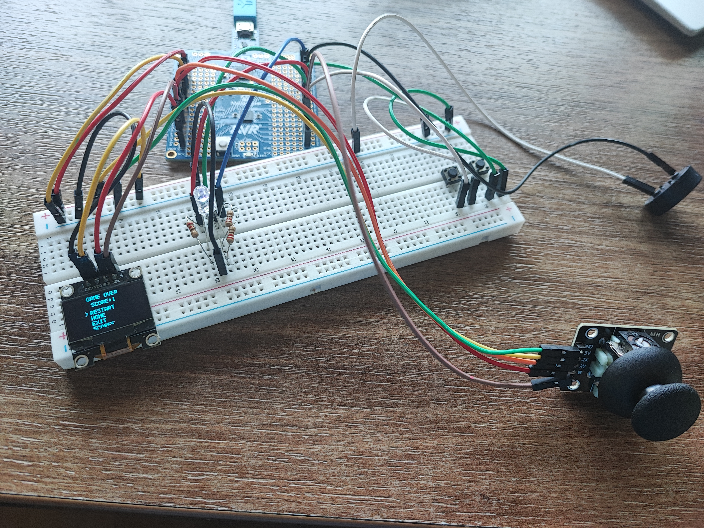
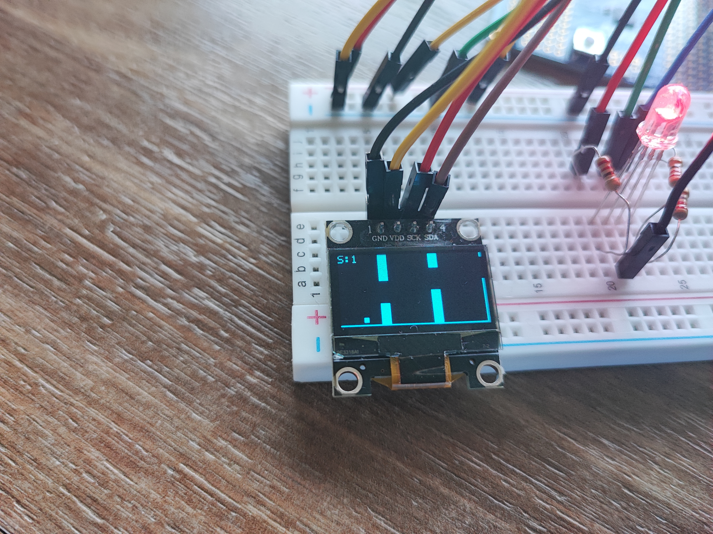
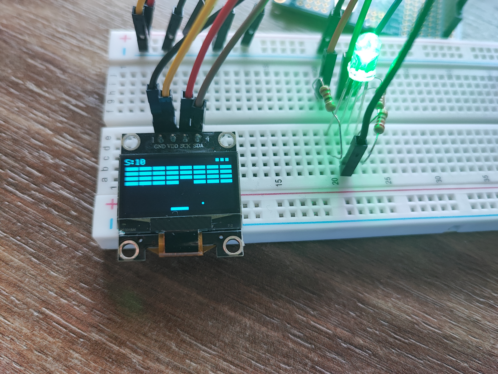

# MiniGameConsole Photo Gallery

This gallery showcases the physical assembly, component layout, and active gameplay screens of the **MiniGameConsole**.

## Console Overview
The console is built around the ATmega328P Xplained Mini development board, featuring a custom breadboard assembly, a dual-axis analog joystick, dedicated tactical buttons (BACK and HOME), an RGB status LED, a passive buzzer, and a 128×64 SSD1306 OLED display.

---

## Gameplay Snapshots

### Flappy Bird
In Flappy Bird, the player navigates the bird through randomly generated obstacle pipes by pressing the joystick click button to flap. The game features real-time gravity simulation, ascending score counts, dynamic RGB LED color changes, and passive buzzer sound effects.

### Breakout
In Breakout, the player controls the paddle horizontally using the analog joystick to bounce the ball and destroy a grid of 4×8 bricks. The ball bounces off the borders, paddle, and bricks. The paddle settings screen allows tuning ball speed, paddle speed, and starting lives.

